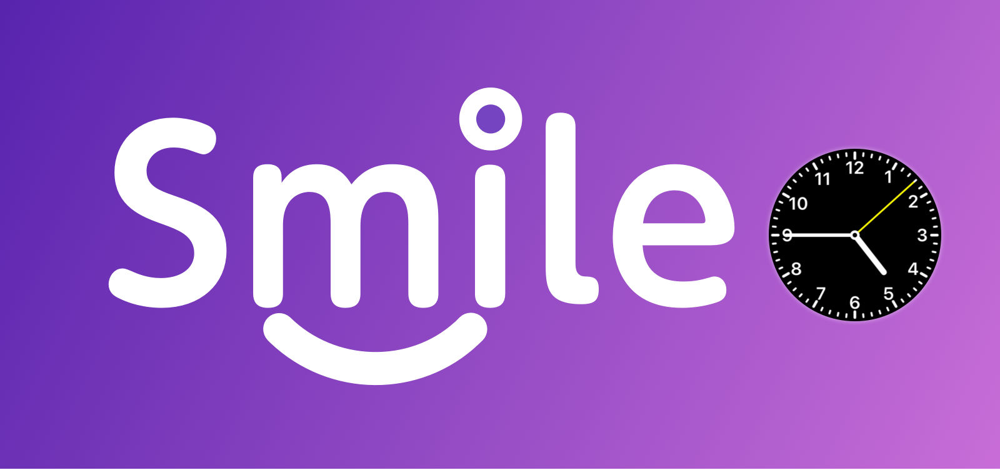

# SmileClock

A library for make Clock UI simple.

#What can it do for you?

#### 1. Live rendering in Storyboard.

**Step1.** Drag a view in storyboard, and set the class to `SmileClockContainerView.h`.

**Step2.** Click the attributes inspector, and set the color & clock style you like.

#### 2. Use image to customize Clock UI.

#### 3. Data model easy to use.

# Contributions

* Warmly welcome to submit a pull request.

# Contact

* If you have some advice or find some issue, please contact me.
* Email [me](liu044100@gmail.com)

# License

SmileClock is available under the MIT license. See the LICENSE file for more info.
